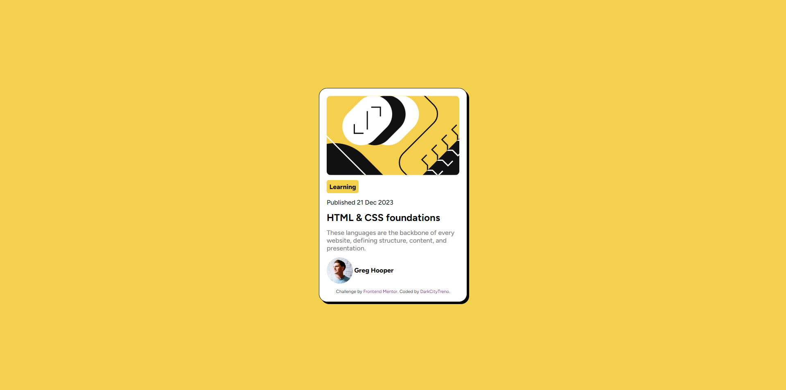

# Frontend Mentor - Blog preview card solution

This is a solution to the [Blog preview card challenge on Frontend Mentor](https://www.frontendmentor.io/challenges/blog-preview-card-ckPaj01IcS). Frontend Mentor challenges help you improve your coding skills by building realistic projects.

## Table of contents

- [Overview](#overview)
  - [The challenge](#the-challenge)
  - [Screenshot](#screenshot)
- [My process](#my-process)
  - [Built with](#built-with)
  - [What I learned](#what-i-learned)
- [Author](#author)
- [Acknowledgments](#acknowledgments)

## Overview

### The challenge

Users should be able to:

- See hover and focus states for all interactive elements on the page

### Screenshot

## My process

### Built with

- Semantic HTML5 markup
- Flexbox
- CSS Grid

### What I learned

This challenge was in many ways very similar to the first one which is in my opinion actually a good thing, but I learned box-shadow property, and pseudo-classes visited, hover, focus, active.

## Author

- Frontend Mentor - [@yourusername](https://www.frontendmentor.io/profile/DarkCityTreno)

## Acknowledgments

Didn't forget I can just do `css .main {padding: 5%;}` instead of `css .main{padding: 5% 5%;}`, as was noted by @DylandeBruijn in my first challenge :D
